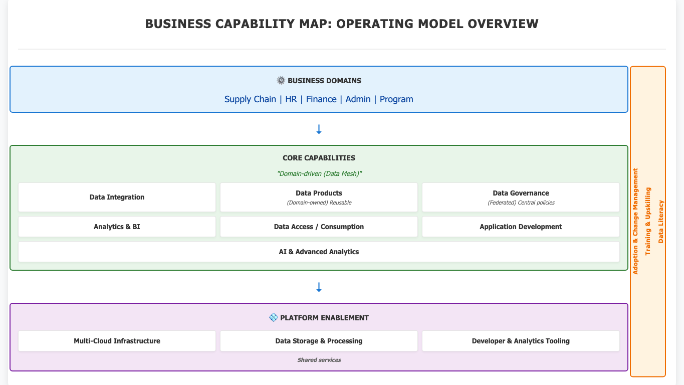

# Business Architecture

## Baseline Business Architecture (Current State)

### Operating Model

The organization operates through multiple domains (Supply Chain, HR, Finance, Admin, Program) that function largely independently. Each domain manages its own data, tools, and processes with limited coordination across domains.

Decision-making is decentralized, but execution is constrained by dependencies on centralized IT teams and platform-specific processes.

### Data Ownership and Usage

Data ownership is unclear and inconsistent across domains. In many cases, IT or platform teams control access to data, even when business teams are responsible for its use.

Data is primarily treated as an input for reporting rather than as a reusable asset. Cross-domain data usage is limited, and teams often rely only on their own datasets.

### Application Landscape

Applications are developed and used in a fragmented manner:

- BI tools such as Tableau are widely used for reporting
- Platform-specific applications such as Palantir are used in selected domains
- Custom tools are developed independently by teams

There is no standardized approach to application development, resulting in duplicated functionality and inconsistent user experiences.

### Data and Platform Landscape

Multiple platforms are used across domains, including:

- SAP HANA / SAP Datasphere (Finance)
- Workday (HR)
- AWS + Tableau Server (Admin, Program)
- Palantir (Supply Chain)
- Azure (emerging in some programs)

These platforms operate in silos with limited interoperability. Data is stored within platform-specific environments and is not easily shared across systems.

### Key Challenges

- Fragmentation: Data, applications, and platforms are siloed by domain
- Duplication: Pipelines, datasets, and dashboards are recreated across teams
- Limited interoperability: No standard APIs, schemas, or data contracts
- Ownership issues: Data is controlled by IT or platforms rather than business domains
- Governance gaps: No consistent enterprise-wide data governance framework
- Dependency bottlenecks: Teams rely on IT and vendors to access or process data
- High cost: Platform and vendor dependencies increase operational costs
- Slow delivery: Data access and integration can take months
- Skills gap: Limited data engineering and data product capabilities

## Target Business Architecture (Future State)

### Target Operating Model

The organization adopts a domain-oriented operating model where each domain (Supply Chain, HR, Finance, Admin, Program) is responsible for its own data products, analytics, and digital solutions.

Ownership shifts from centralized IT to domain teams, while a central platform function provides shared infrastructure, governance, and standards.

### Target Operating Model Visual

### Roles and Responsibilities

**Domain Teams**

- Own data products (datasets, APIs, reports)
- Own business logic and analytics
- Develop domain-specific applications
- Ensure data quality within their domain

**Central Platform / Data Function**

- Provide shared infrastructure (multi-cloud platform)
- Define standards (data models, APIs, contracts)
- Enforce governance (security, lineage, catalog)
- Enable teams through tooling and training

### Data and Application Model

- Data is treated as a data product, not a reporting output
- Data products are discoverable, reusable, and standardized
- Applications are built on top of data products using shared patterns (APIs and services)
- Duplication across domains is avoided through reuse and common architecture standards

### Platform Strategy

- Multi-cloud architecture (Azure, AWS, SAP, Palantir)
- Interoperability enabled through shared standards, data contracts, and an integration layer
- No single platform monopoly
- Domains use the right tool within enterprise standards

### Governance Model

- Federated governance model:
  - Centralized policies
  - Decentralized execution
- Governance capabilities include:
  - Metadata and catalog
  - Lineage
  - Access control
  - Quality standards

### Expected Outcomes

- Reduced duplication of pipelines, datasets, and applications
- Faster delivery of analytics and digital solutions
- Lower dependency on centralized IT and vendors
- Improved interoperability across platforms
- Increased data trust and quality
